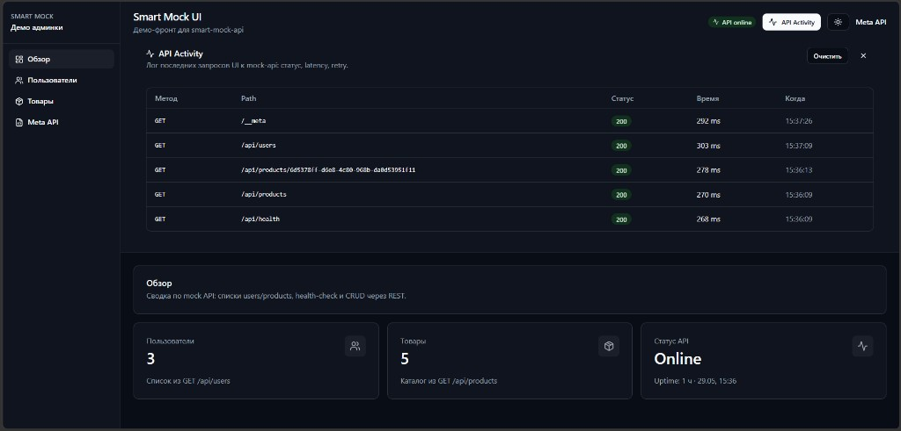

# Smart Mock UI


Демо admin-panel для [smart-mock-api](https://github.com/gatzxx/smart-mock-api): dashboard, CRUD, sortable tables, detail pages, Meta API, OpenAPI preview.

## Live Demo

**[Открыть demo →](https://smart-mock-ui.vercel.app)**

| Ресурс | URL |
|--------|-----|
| Dashboard | https://smart-mock-ui.vercel.app/ |
| API users | https://smart-mock-api.onrender.com/api/users |
| Meta | https://smart-mock-api.onrender.com/__meta |
| OpenAPI | https://smart-mock-api.onrender.com/openapi.json |



> Скриншот статичный. Актуальная версия всегда на live-ссылке выше.

## Страницы

| Маршрут | Описание |
|---------|----------|
| `/` | Dashboard: KPI, health API, ссылки на разделы |
| `/users` | Список пользователей, поиск, sort + pagination |
| `/users/new` | Создание пользователя (POST) |
| `/users/:id/edit` | Редактирование (PATCH) |
| `/users/:id` | Профиль: avatar, phone, bio, breadcrumbs |
| `/products` | Список товаров, badge наличия, поиск, sort + pagination |
| `/products/new` | Создание товара (POST) |
| `/products/:id/edit` | Редактирование (PATCH) |
| `/products/:id` | Карточка товара, breadcrumbs |
| `/meta` | Discovery-эндпoинты, curl copy, OpenAPI JSON preview |
| `*` | Страница 404 |

## CRUD demo flow

1. Открыть `/users` или `/products`
2. **Создать** - кнопка «Добавить» → форма → POST → toast → запись в списке
3. **Редактировать** - actions menu или detail → PATCH → список обновляется
4. **Удалить** - actions menu → confirm → DELETE → запись исчезает из списка
5. Dashboard KPI считает те же query keys, что и списки

Данные живут в **in-memory store** mock-api. После cold start на Render store пустой.

## Cache и данные

- **TanStack Query** - fetch lists и details с shared `queryKeys`
- **Mutations** - `syncListAfterCreate/Update/Delete` обновляет list cache сразу, затем `invalidateQueries` с `refetchType: 'all'`
- **Dashboard counts** - читают те же keys (`users`, `products`), поэтому KPI синхронны со списками
- **API responses** - валидируются Zod-схемами в `src/lib/schemas/`

На production API (Render free tier) данные **не персистентны**: cold start сбрасывает store.

## UX-состояния (на каждой data-странице)

- **Loading** - skeleton (`RESPONSE_DELAY_MS=1000` на mock-api)
- **Error** - alert + «Повторить» + toast при успешном refetch
- **Empty** - card при пустом массиве
- **Search empty** - «Ничего не найдено» при фильтре
- **Theme** - light/dark toggle, сохранение в localStorage (без flash на load)
- **API Activity** - лог запросов UI к mock-api (status, latency)
- **Error boundary** - global fallback при runtime error в React tree

## Локальный запуск

```bash
# Терминал 1 - mock-api
git clone https://github.com/gatzxx/smart-mock-api.git
cd smart-mock-api && cp .env.example .env && npm install && npm run dev

# Терминал 2 - UI
git clone https://github.com/gatzxx/smart-mock-ui.git
cd smart-mock-ui && cp .env.example .env && npm install && npm run dev
```

http://localhost:5173 · API: http://localhost:3000

## Конфигурация

Переменные из `.env.example`:

| Переменная | По умолчанию | Описание |
|------------|--------------|----------|
| `VITE_API_URL` | `http://localhost:3000` | Base URL mock-api (без trailing slash) |

На Vercel задай `VITE_API_URL=https://smart-mock-api.onrender.com`.

## Скрипты

| Команда | Действие |
|---------|----------|
| `npm run dev` | Dev-сервер |
| `npm run build` | Production-сборка |
| `npm run lint` | ESLint |
| `npm run format:check` | Prettier check |
| `npm run check` | typecheck + lint + format + test |

## Связанные репозитории

- [smart-mock-api](https://github.com/gatzxx/smart-mock-api) - schema-driven mock (in-memory CRUD, OpenAPI, hot-reload)

## Стек

Vite · React 19 · TypeScript · TanStack Query · TanStack Table · React Router · shadcn/ui · Tailwind · Zod · sonner · Vitest · ESLint · GitHub Actions

## Лицензия

MIT
